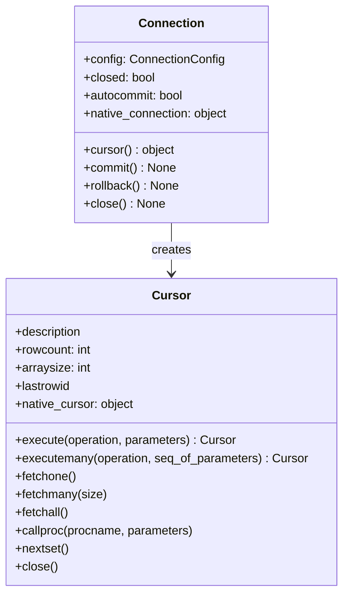

# API Reference

Reference for public DB-API 2.0 surface in `pyaltibase`.

## Module-level API (`pyaltibase`)

### Constants

| Name | Value | Meaning |
|---|---|---|
| `apilevel` | `"2.0"` | DB-API level implemented |
| `threadsafety` | `1` | Module can be shared, connections should not be shared concurrently |
| `paramstyle` | `"qmark"` | SQL placeholders use `?` |

### Function

```python
pyaltibase.connect(
    host: str = "localhost",
    port: int = 20300,
    database: str = "",
    user: str = "sys",
    password: str = "",
    dsn: str | None = None,
    driver: str = "ALTIBASE_HDB_ODBC_64bit",
    login_timeout: int | None = None,
    nls_use: str | None = None,
    long_data_compat: bool = True,
    **kwargs: object,
) -> Connection
```

!!! note "Autocommit parameter"
    `autocommit` is accepted via `**kwargs` and routed to `Connection(...)`.

## Connection class (`pyaltibase.connection.Connection`)

### Core attributes and properties

| Name | Type | Description |
|---|---|---|
| `config` | `ConnectionConfig` | Stored connection settings |
| `closed` | `bool` | True when closed |
| `autocommit` | `bool` | Get/set transaction autocommit |
| `native_connection` | `object` | Wrapped `pyodbc` connection |

### Methods

```python
cursor() -> object
commit() -> None
rollback() -> None
close() -> None
__enter__() -> Connection
__exit__(exc_type, exc, tb) -> None
```

| Method | Description |
|---|---|
| `cursor()` | Creates a wrapped `Cursor` over native cursor |
| `commit()` | Commits current transaction |
| `rollback()` | Rolls back current transaction |
| `close()` | Closes tracked cursors and native connection |
| context manager | Commits on success, rollbacks on error, then closes |

## Cursor class (`pyaltibase.cursor.Cursor`)

### Properties

| Name | Type | Description |
|---|---|---|
| `description` | `tuple[DescriptionItem, ...] \| None` | Result metadata |
| `rowcount` | `int` | Affected/available row count from backend |
| `arraysize` | `int` | Default fetch batch size |
| `lastrowid` | `object \| None` | Backend last inserted row id if available |
| `native_cursor` | `object` | Wrapped native cursor |

### Methods

```python
close() -> None
execute(operation: str, parameters: Sequence[Any] | Mapping[str, Any] | None = None) -> Cursor
executemany(operation: str, seq_of_parameters: Sequence[Sequence[Any] | Mapping[str, Any]]) -> Cursor
fetchone() -> tuple[Any, ...] | None
fetchmany(size: int | None = None) -> list[tuple[Any, ...]]
fetchall() -> list[tuple[Any, ...]]
setinputsizes(sizes: Any) -> None
setoutputsize(size: int, column: int | None = None) -> None
callproc(procname: str, parameters: Sequence[Any] = ()) -> Sequence[Any]
nextset() -> None
__iter__() -> Cursor
__next__() -> tuple[Any, ...]
__enter__() -> Cursor
__exit__(exc_type, exc, tb) -> None
```

!!! warning "Parameter binding"
    Mapping (dict) parameters are rejected for `qmark` style and raise `ProgrammingError`.
    Use positional sequences.

## Type constructors (`pyaltibase.types`)

```python
Date(year: int, month: int, day: int) -> datetime.date
Time(hour: int, minute: int, second: int) -> datetime.time
Timestamp(year: int, month: int, day: int, hour: int, minute: int, second: int) -> datetime.datetime
DateFromTicks(ticks: float) -> datetime.date
TimeFromTicks(ticks: float) -> datetime.time
TimestampFromTicks(ticks: float) -> datetime.datetime
Binary(value: bytes | bytearray | str) -> bytes
```

## DBAPIType objects

`pyaltibase` exposes PEP 249 type objects as `DBAPIType` instances.

| Name | ODBC SQL type codes |
|---|---|
| `STRING` | `{1, 12}` (`SQL_CHAR`, `SQL_VARCHAR`) |
| `BINARY` | `{-2, -3, -4}` (`SQL_BINARY`, `SQL_VARBINARY`, `SQL_LONGVARBINARY`) |
| `NUMBER` | `{-5, 2, 3, 4, 5, 6, 7, 8}` (`SQL_BIGINT`, `SQL_NUMERIC`…`SQL_DOUBLE`) |
| `DATETIME` | `{91, 92, 93}` (`SQL_TYPE_DATE`, `SQL_TYPE_TIME`, `SQL_TYPE_TIMESTAMP`) |
| `ROWID` | `{15}` |

## Public exception classes

The following are exported from package root:

- `Warning`
- `Error`
- `InterfaceError`
- `DatabaseError`
- `DataError`
- `OperationalError`
- `IntegrityError`
- `InternalError`
- `ProgrammingError`
- `NotSupportedError`

## Class diagram


