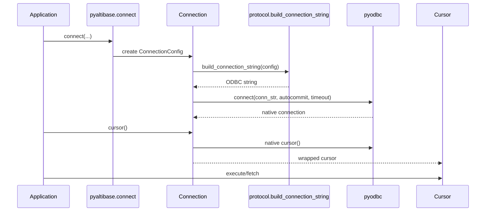
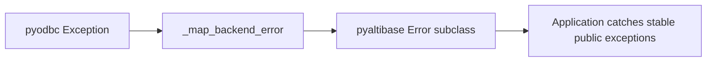

# Architecture

## Layers

1. Application code calls `pyaltibase.connect(...)`.
2. `pyaltibase.connection.Connection` builds an Altibase ODBC connection string.
3. `pyodbc` opens the real database connection.
4. `pyaltibase.cursor.Cursor` delegates execute and fetch operations to the native cursor.
5. Backend exceptions are mapped into package-owned DB-API exception classes.

## Design choices

- `qmark` parameter style matches `pyodbc` and DB-API 2.0 expectations.
- Package-owned exception classes keep the public API stable.
- Connection-string creation is isolated in `protocol.py` so backend behavior is testable.
- Unit tests use a fake `pyodbc` backend; e2e tests validate the real driver path.

## End-to-end runtime view

## Error translation boundary

!!! note "Stability contract"
    Application code should catch `pyaltibase` exceptions, not backend-specific exceptions,
    to keep behavior stable when backend details evolve.

!!! tip "Extensibility"
    New connection attributes can be added without changing method signatures by routing through `**kwargs` into `ConnectionConfig.options`.
