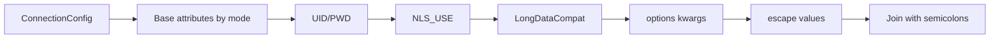

# Connection Guide

This page documents all connection inputs used by `pyaltibase.connect()` and `ConnectionConfig`.

## ConnectionConfig fields

`pyaltibase.connection.Connection` stores inputs in `ConnectionConfig`.

| Field | Type | Default | Description |
|---|---|---:|---|
| `host` | `str` | `"localhost"` | Altibase host used in driver mode |
| `port` | `int` | `20300` | Altibase listener port used in driver mode |
| `database` | `str` | `""` | Database name; omitted from connection string when empty |
| `user` | `str` | `"sys"` | ODBC user (`UID`) |
| `password` | `str` | `""` | ODBC password (`PWD`) |
| `dsn` | `str \| None` | `None` | DSN name; when set, DSN mode is used |
| `driver` | `str` | `"ALTIBASE_HDB_ODBC_64bit"` | ODBC driver name for driver mode |
| `autocommit` | `bool` | `False` | Passed to `pyodbc.connect(..., autocommit=...)` |
| `login_timeout` | `int \| None` | `None` | Routed to `pyodbc.connect(..., timeout=...)` |
| `nls_use` | `str \| None` | `None` | Adds `NLS_USE=<value>` to connection string |
| `long_data_compat` | `bool` | `True` | Adds `LongDataCompat=on/off` to connection string |
| `options` | `dict[str, object]` | `{}` | Extra connection attributes from `**kwargs` |

!!! warning "Do not guess parameter names"
    Use exact field names shown above. Unknown `**kwargs` are forwarded as additional ODBC attributes.

## Driver mode flow

Use driver mode when you provide `host` and `port` directly.

```python
import pyaltibase

conn = pyaltibase.connect(
    host="localhost",
    port=20300,
    database="mydb",
    user="sys",
    password="manager",
    driver="ALTIBASE_HDB_ODBC_64bit",
    nls_use="UTF8",
    long_data_compat=True,
)
```

## DSN mode flow

Use DSN mode when ODBC manager already defines the datasource.

```python
import pyaltibase

conn = pyaltibase.connect(
    dsn="ALTIBASE_TEST",
    user="sys",
    password="manager",
    nls_use="UTF8",
    long_data_compat=True,
)
```

```mermaid
flowchart TD
    A[pyaltibase.connect] --> B{dsn provided?}
    B -->|Yes| C[Use DSN mode]
    B -->|No| D[Use driver mode]
    C --> E[Build DSN + credentials attributes]
    D --> F[Build DRIVER + Server + PORT (+ Database)]
    E --> G[Append NLS_USE and LongDataCompat]
    F --> G
    G --> H[Append kwargs options]
    H --> I[pyodbc.connect]
```

## Connection string assembly details

`build_connection_string(config)` in `pyaltibase.protocol` builds ordered ODBC attributes:

1. DSN mode: `DSN` first
2. Driver mode: `DRIVER`, `Server`, `PORT`, optional `Database`
3. `UID`, `PWD` when non-empty
4. `NLS_USE` when configured
5. `LongDataCompat=on/off`
6. Extra options from `config.options` (`**kwargs`)

Values are escaped with braces when needed (`;`, spaces, braces, or leading/trailing spaces).



## NLS_USE (character encoding)

`nls_use` controls the `NLS_USE` ODBC attribute.

!!! info "When to set"
    Set `nls_use` when client/server character encoding behavior must be explicit.
    Example: `nls_use="UTF8"`.

!!! warning "Symptoms of mismatch"
    Garbled non-ASCII text or decode-related backend errors are common signs.

## LongDataCompat (LOB handling)

`long_data_compat` maps to `LongDataCompat`:

- `True`  -> `LongDataCompat=on`
- `False` -> `LongDataCompat=off`

!!! tip "Troubleshooting"
    If you see issues around large character/binary payloads, try toggling this flag and retest.

## Connection kwargs routing

Unrecognized keyword arguments passed to `pyaltibase.connect()` are stored in `ConnectionConfig.options` and added to the ODBC connection string.

```python
conn = pyaltibase.connect(
    host="localhost",
    user="sys",
    password="manager",
    ApplicationName="my-app",
    FetchSize=2000,
)
```

This becomes extra attributes like `ApplicationName=my-app;FetchSize=2000;`.

## Common connection errors

!!! failure "pyodbc missing"
    `InterfaceError: pyodbc is required to use pyaltibase...`

    Install `pyodbc` and ensure system ODBC libraries are present.

!!! failure "Driver or DSN not found"
    Raised by backend and mapped to package exceptions.
    Verify ODBC driver name (`driver`) or DSN name (`dsn`).

!!! failure "Connection refused on default port"
    `port=20300` is the default. Confirm server host/port and firewall settings.
