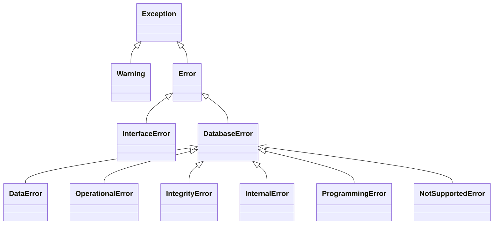

# Error Handling

`pyaltibase` exposes a package-owned PEP 249 exception hierarchy and maps backend `pyodbc` errors into these classes.

## Exception hierarchy



## Exception classes

| Class | Base | When to expect |
|---|---|---|
| `Warning` | `Exception` | Important warnings |
| `Error` | `Exception` | Generic package error |
| `InterfaceError` | `Error` | Interface usage problems (e.g., closed connection/cursor, missing pyodbc) |
| `DatabaseError` | `Error` | Database-side failures |
| `DataError` | `DatabaseError` | Invalid/overflow/truncation-like data problems |
| `OperationalError` | `DatabaseError` | Operational failures (connectivity, runtime state) |
| `IntegrityError` | `DatabaseError` | Constraint/integrity failures |
| `InternalError` | `DatabaseError` | Internal engine/backend errors |
| `ProgrammingError` | `DatabaseError` | Invalid SQL or API misuse |
| `NotSupportedError` | `DatabaseError` | Unsupported operation/API |

`DatabaseError` instances carry:

- `msg`
- `code`
- `errno` — native error number extracted from backend exception (when available)
- `sqlstate` — 5-character SQLSTATE code extracted from backend exception (when available)

Backend `errno` and `sqlstate` are automatically preserved via `_extract_backend_error_details` during error mapping.

## Backend mapping (`pyodbc` -> `pyaltibase`)

`Connection._map_backend_error` maps by backend class name in this order:

1. `InterfaceError`
2. `DataError`
3. `IntegrityError`
4. `InternalError`
5. `ProgrammingError`
6. `NotSupportedError`
7. `OperationalError`
8. `DatabaseError`
9. `Error`
10. Fallback: `Error(str(exc))`

!!! note "Why this matters"
    You can catch package-owned exceptions consistently even though runtime backend is `pyodbc`.

## Error handling patterns

### Connection and execution boundary

```python
import pyaltibase
from pyaltibase import InterfaceError, OperationalError, ProgrammingError

try:
    with pyaltibase.connect(host="localhost", port=20300, user="sys", password="manager") as conn:
        with conn.cursor() as cur:
            cur.execute("SELECT 1")
            rows = cur.fetchall()
except InterfaceError as exc:
    print(f"Interface setup issue: {exc}")
except OperationalError as exc:
    print(f"Operational database issue: {exc}")
except ProgrammingError as exc:
    print(f"SQL/API issue: {exc}")
```

### Transaction safety with rollback

```python
import pyaltibase
from pyaltibase import DatabaseError

conn = pyaltibase.connect(host="localhost", user="sys", password="manager")
try:
    cur = conn.cursor()
    cur.execute("INSERT INTO t(a) VALUES (?)", [1])
    conn.commit()
except DatabaseError:
    conn.rollback()
    raise
finally:
    conn.close()
```

### Closed resource guardrails

!!! warning "Closed connection"
    Calling `cursor()`, `commit()`, `rollback()`, or accessing `native_connection` on a closed connection raises `InterfaceError("connection is closed")`.

!!! warning "Closed cursor"
    Calling cursor operations after `close()` raises `InterfaceError("cursor is closed")`.
