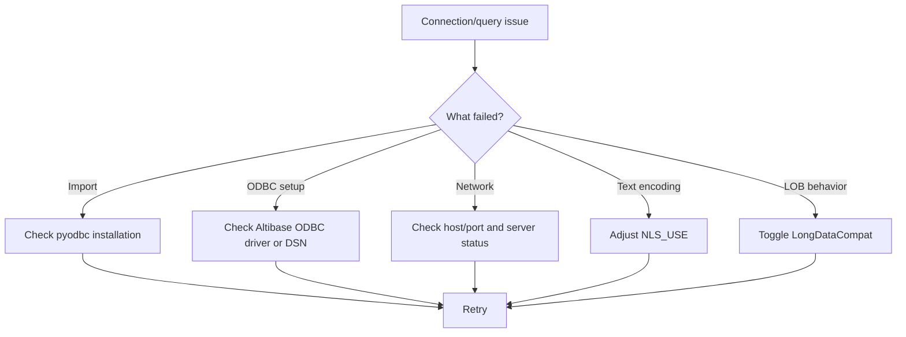

# FAQ and Troubleshooting



??? question "pyodbc not found"
    **Symptom**

    - `InterfaceError: pyodbc is required to use pyaltibase...`

    **Fix**

    1. Install `pyodbc` in the active environment.
    2. Ensure system ODBC manager/libraries are installed.
    3. Re-run your script in the same Python environment.

    ```bash
    pip install pyodbc
    ```

??? question "Altibase ODBC driver not found"
    **Symptom**

    - Backend connection error indicating driver or DSN is missing.

    **Fix**

    1. Verify installed driver name matches `driver` argument exactly.
    2. If using DSN, verify DSN exists and is readable by runtime user.
    3. Check ODBC manager configuration files and architecture (32/64-bit).

??? question "Connection refused (default port 20300)"
    **Symptom**

    - Connection attempt fails with network/refused error.

    **Fix**

    1. Confirm Altibase server is running.
    2. Confirm target host and `port=20300` (or your custom port).
    3. Check firewall/security-group/network-policy rules.
    4. Validate service bind address from database host.

??? question "NLS_USE encoding issues"
    **Symptom**

    - Non-ASCII text appears corrupted or decoding behaves unexpectedly.

    **Fix**

    1. Set explicit `nls_use` in `connect()`.
    2. Align setting with server-side expectations.
    3. Re-test with representative multilingual data.

    ```python
    conn = pyaltibase.connect(
        host="localhost",
        user="sys",
        password="manager",
        nls_use="UTF8",
    )
    ```

??? question "LONG_DATA_COMPAT errors"
    **Symptom**

    - Errors or unexpected behavior when reading/writing large text or binary payloads.

    **Fix**

    1. Toggle `long_data_compat` and retry.
    2. Validate behavior with real LOB sizes in your environment.

    ```python
    conn = pyaltibase.connect(
        host="localhost",
        user="sys",
        password="manager",
        long_data_compat=False,
    )
    ```

!!! tip "Still stuck?"
    Capture the exact exception class and message (`type(exc).__name__`, `str(exc)`), plus your connection mode (DSN vs driver) and ODBC driver name before escalating.
