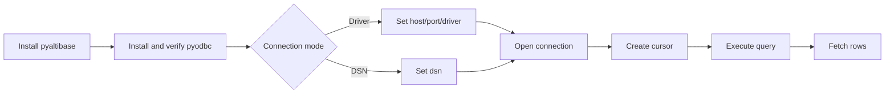

# Quick Start

Connect to Altibase in 5 minutes with `pyaltibase`.

## Prerequisites

!!! info "Before you start"
    You need all of the following:

    - Running Altibase server
    - Python 3.9+
    - `pyodbc` installed
    - Altibase ODBC driver installed and visible to your ODBC manager

!!! warning "Driver requirement"
    `pyaltibase` is a DB-API wrapper over `pyodbc`. If `pyodbc` or the Altibase driver is missing,
    connection creation will fail with `InterfaceError`.

## 1) Install package

```bash
pip install pyaltibase
```

## 2) Choose connection mode

=== "Driver mode (host/port)"

    ```python
    import pyaltibase

    conn = pyaltibase.connect(
        host="localhost",
        port=20300,
        database="mydb",
        user="sys",
        password="manager",
        driver="ALTIBASE_HDB_ODBC_64bit",
        nls_use="UTF8",
        long_data_compat=True,
    )
    ```

=== "DSN mode"

    ```python
    import pyaltibase

    conn = pyaltibase.connect(
        dsn="ALTIBASE_TEST",
        user="sys",
        password="manager",
        nls_use="UTF8",
    )
    ```

## 3) Run a basic query

```python
import pyaltibase

with pyaltibase.connect(host="localhost", port=20300, user="sys", password="manager") as conn:
    with conn.cursor() as cur:
        cur.execute("SELECT 1")
        print(cur.fetchall())
```

## 4) Workflow overview



!!! tip "Gotcha: parameter style"
    `pyaltibase.paramstyle` is `qmark`, so placeholders are `?`, not `%s` or named style.

    ```python
    cur.execute("SELECT ?", [1])
    ```

!!! note "Next step"
    Continue with [Connection Guide](connection.md) for all connection options and routing details.
