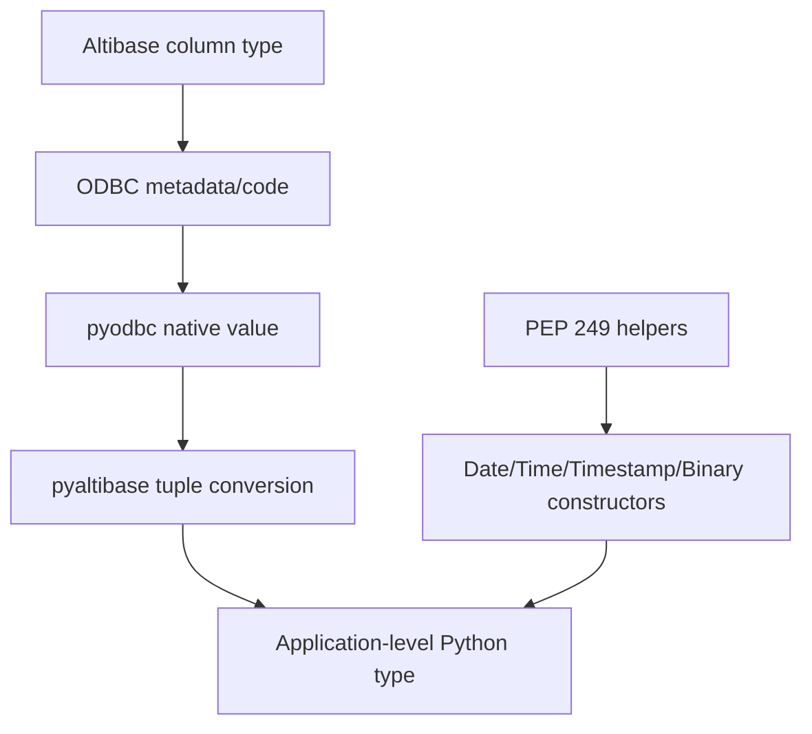

# Type Mapping

`pyaltibase` follows PEP 249 type objects and constructors.

## PEP 249 type objects

`DBAPIType` supports comparison with integers and other `DBAPIType` objects.

| Object | ODBC SQL type codes | Category |
|---|---|---|
| `STRING` | `{1, 12}` (`SQL_CHAR`, `SQL_VARCHAR`) | Character/string families |
| `BINARY` | `{-2, -3, -4}` (`SQL_BINARY`, `SQL_VARBINARY`, `SQL_LONGVARBINARY`) | Binary payloads |
| `NUMBER` | `{-5, 2, 3, 4, 5, 6, 7, 8}` (`SQL_BIGINT`, `SQL_NUMERIC`…`SQL_DOUBLE`) | Numeric families |
| `DATETIME` | `{91, 92, 93}` (`SQL_TYPE_DATE`, `SQL_TYPE_TIME`, `SQL_TYPE_TIMESTAMP`) | Date/time families |
| `ROWID` | `{15}` | Row identifier |

## Type constructors

| Constructor | Returns | Typical use |
|---|---|---|
| `Date(y, m, d)` | `datetime.date` | Bind SQL `DATE` |
| `Time(h, m, s)` | `datetime.time` | Bind SQL `TIME` |
| `Timestamp(...)` | `datetime.datetime` | Bind SQL `TIMESTAMP` |
| `DateFromTicks(t)` | `datetime.date` | Convert Unix ticks to date |
| `TimeFromTicks(t)` | `datetime.time` | Convert Unix ticks to time |
| `TimestampFromTicks(t)` | `datetime.datetime` | Convert Unix ticks to timestamp |
| `Binary(v)` | `bytes` | Bind binary data (`bytes`, `bytearray`, or UTF-8 encoded `str`) |

## Altibase SQL type to Python type guidance

The exact runtime mapping comes from Altibase ODBC driver + `pyodbc`. The following table summarizes common outcomes when fetching rows:

| Altibase SQL type (common) | Typical Python value | DB-API category |
|---|---|---|
| `CHAR`, `VARCHAR` | `str` | `STRING` |
| `NCHAR`, `NVARCHAR` | `str` | `STRING` |
| `CLOB` | `str` (driver-dependent for large values) | `STRING` |
| `BINARY`, `VARBINARY` | `bytes` | `BINARY` |
| `BLOB` | `bytes` (driver-dependent for large values) | `BINARY` |
| `SMALLINT`, `INTEGER`, `BIGINT` | `int` | `NUMBER` |
| `NUMERIC`, `DECIMAL` | `decimal.Decimal` or `float` (driver-dependent) | `NUMBER` |
| `REAL`, `FLOAT`, `DOUBLE` | `float` | `NUMBER` |
| `DATE` | `datetime.date` | `DATETIME` |
| `TIME` | `datetime.time` | `DATETIME` |
| `TIMESTAMP` | `datetime.datetime` | `DATETIME` |
| `ROWID` | Driver-provided scalar | `ROWID` |

!!! warning "Driver-dependent behavior"
    Large object retrieval and some numeric conversions may vary by ODBC driver version and settings.
    Validate mappings in your environment.

## Type resolution flow



## Practical examples

```python
import pyaltibase
from pyaltibase import Date, Timestamp, Binary

with pyaltibase.connect(host="localhost", user="sys", password="manager") as conn:
    with conn.cursor() as cur:
        cur.execute(
            "INSERT INTO sample_table(created_on, created_at, payload) VALUES (?, ?, ?)",
            [Date(2026, 4, 6), Timestamp(2026, 4, 6, 10, 30, 0), Binary("hello")],
        )
```
